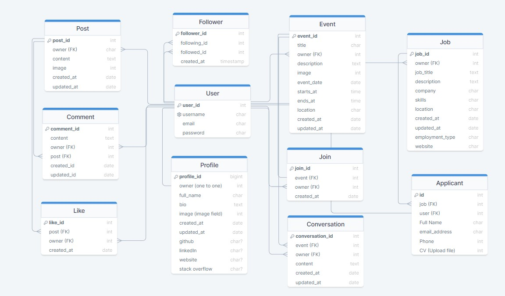
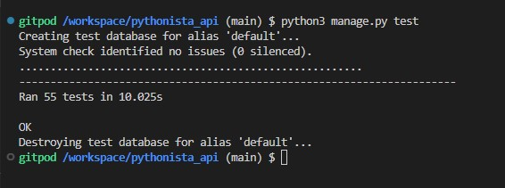
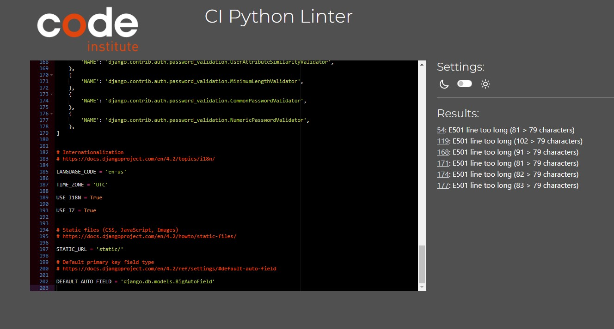
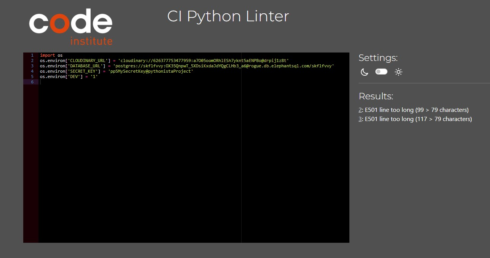
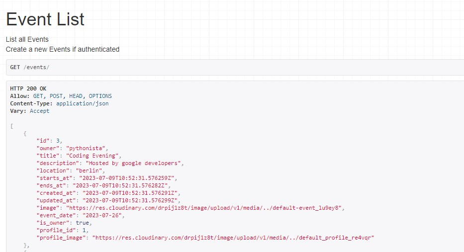
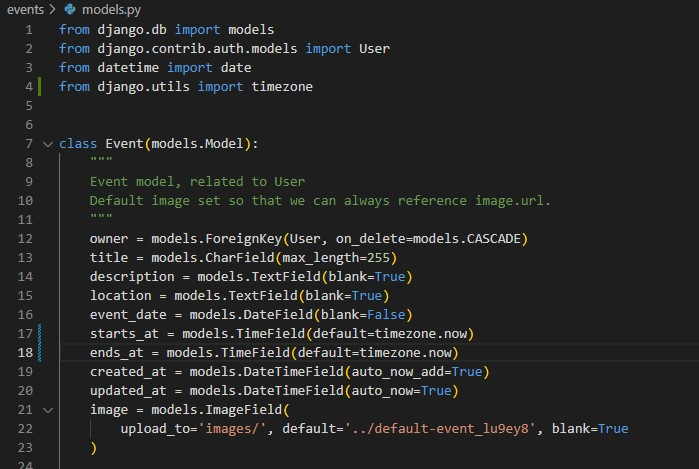
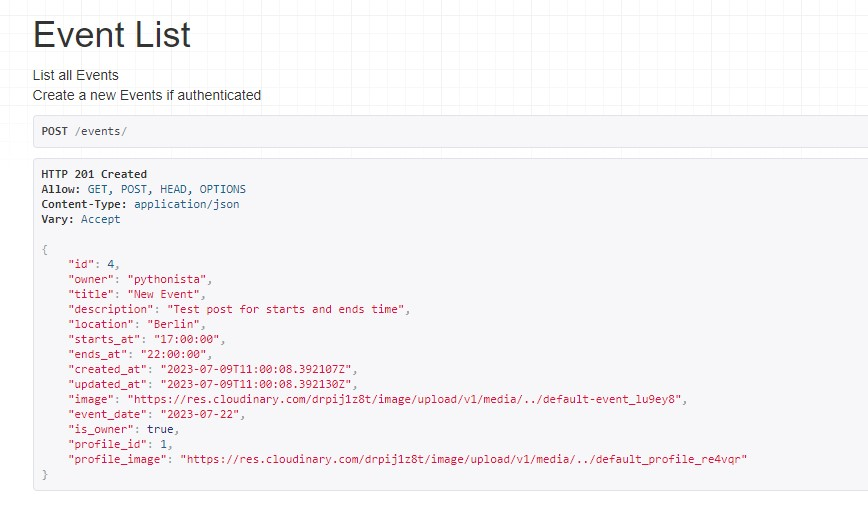
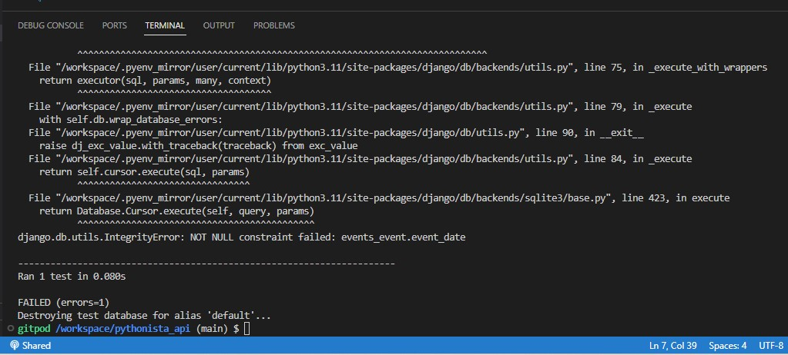
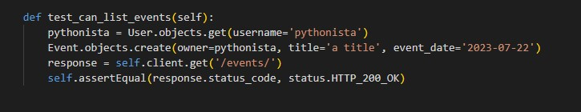

# Pythonista DRF API

The Pythonista DRF API is a back-end API created using Django Rest Framework to serve the Pythonista React app. It handles all backend functionality including user Profiles, Posts, Comments, Likes, Events, Conversation on an event's post, Join, Following and Followers feature.

## Database Designs
The following Entity Relationship Diagram was created to show the models used. The in-built Django User model was used for this project, and the following custom models were created:

1. Profiles (Slightly customized from the Django standard User model)
2. Posts (Text-base post publishing )
3. Comments (To make comment on a post to interact in community)
4. Likes (Show intersting content)
5. Events (A post publicising a future event)
6. Conversations (All user discussions related an event while it's being promoted)
7. Join (To indicate if the user plans to attend the event)


    Note: I was planning to have a job feature in my app where users could post a job or apply for a job, and I created a data model for that. Unfortunately, due to some unexpected issues, I wasn't able to implement this feature. A clarification can be found at the end of the document.


### _Database Schema_

The relationships between all of these models is summarized in the followed entity relationship diagram:




## Technologies Used
**_Languages_**

Python - Provides the functionality for the DRF backend framework.

**_Frameworks, Libraries & Programs Used_**

1. **Django:** Django was used to create the web application

2. **Django Rest Framework:** The Django rest framework was used to simplify the process between the back and front ends.

3. **PostgreSQL:** PostgreSQL was used as the object-relational database system.

4. **ElephantSQL:** ElephantSQL was used to host the database.
5. **Cloudinary:** A service that hosts image files in the project.

6. **Git:** Git was used for version control by utilizing the Gitpod terminal to commit to Git and Push to GitHub.

7. **GitHub:** GitHub is used to store the projects code after being pushed from Git.

8. **CI Python Linter:** was used to validate the Python code in this project
9. **Heroku:** Heroku was used for the deployed application.

10. **DrawSQLapp:** Development of database schema.
11. **Django CORS:** This Django app adds Cross-Origin-Resource Sharing (CORS) headers to responses, to enable the API to respond to requests from origins other than its own host.

12. **Django Filter:** The django-filter is used to implement ISO datetime filtering functionality.

13. **DRF Simplejwt:** Provides JSON web token authentication.
14. **dj-database-url:** Creates an environment variable to configure the connection to the database.

15. **dj-rest-auth:** Provides REST API endpoints for login and logout.


## Testing
### _A. Unit Testing_

All of the applications have undergone unit testing using the Red, Green, Refactor methodology; the code is contained in the test.py file located in each app directory. The outcome of all testing is as follows:



### _B. Python Testing_

[CI Python Linter](https://pep8ci.herokuapp.com/) was used to validate the Python code in this project. All code passed without errors, except settings.py and env.py which showed `E501 'line too long'` warnings.






### _C. Manual Testing_

Throughout the development process, manual testing got CRUD testing was done to make sure the database was being updated as intended whether adding, reading, updating, or removing data as needed. All apps function properly.

**Prfiles App**

* List View (Read if logged in)
* List View (Read if not logged in)
* Detail View (Read, Update if owner)
* Detail View (Read if not owner)
* Detail View (Read if not logged in)

**Followers App**
* List View (Read, Create if logged in)
* List View (Read if not logged in)
* Detail View (Read, Delete if owner)
* Detail View (Read if not owner)
* Detail View (Read if not logged in)

**Posts App**
* List View (Read, Create if logged in)
* List View (Read if not logged in)
* Detail View (Read, Update, Delete if owner)
* Detail View (Read if not owner)
* Detail View (Read if not logged in)

**Likes App**
* List View (Read, Create if logged in)
* List View (Read if not logged in)
* Detail View (Read, Delete if owner)
* Detail View (Read if not owner)
* Detail View (Read if not logged in)

**Comments App**
* List View (Read, Create if logged in)
* List View (Read if not logged in)
* Detail View (Read, Update, Delete if owner)
* Detail View (Read if not owner)
* Detail View (Read if not logged in)

**Events App**
* List View (Read, Create if logged in)
* List View (Read if not logged in)
* Detail View (Read, Update, Delete if owner)
* Detail View (Read if not owner)
* Detail View (Read if not logged in)

**Conversations App**
* List View (Read, Create if logged in)
* List View (Read if not logged in)
* Detail View (Read, Delete if owner)
* Detail View (Read if not owner)
* Detail View (Read if not logged in)

**Joins App**
* List View (Read, Create if logged in)
* List View (Read if not logged in)
* Detail View (Read, Update, Delete if owner)
* Detail View (Read if not owner)
* Detail View (Read if not logged in)


## Bugs
### _A. Solved Bugs_

 1. While creating the **Event Model** I set the `DateTimeField` for `starts_at` and `ends_at` as `created_at` field. which was wrong for time setting in Event form.
 
 

 I changed the `DateTimeField` field to `TimeField`.

 

 


 2. When writing the test case for the **Events** app, I got a console error about not adding `event_date` on creating the event in the test case because the `event_date` has a required constraint:
 

 So, I added the `event_date` field, and the error is gone.
 


 3. During deployment on Heroku, I got issue. Every time I ran my deployed site, I received a (400) Bad Request error, which was caused by
 `ALLOWED_HOSTS ` both config_var and `ALLOWED_HOSTS` in sttings.py file.
 which the link to `ALLOWED_HOSTS` was borken.
 I just fix the links and redeployed again.


### _B. Unfixed Bugs_
So far none


## Deployment
### _A. Set up JSON Web Tokens_

1. Install JSON Web Token authentication run terminal command `pip install dj-rest-auth`
2. Add `rest_framework.authtoken` and 'dj_rest_auth' to the list of INSTALLED_APPS in settings.py.
3. Add the dj-rest-auth urls paths to the main urls.py file.
```
urlpatterns = [
    
    ...
    path('dj-rest-auth/', include('dj_rest_auth.urls')),
    ]
```
4. Migrate the database with terminal command `python manage.py migrate`
5. For users to be able to register, install Django AllAuth with terminal command pip install `dj-rest-auth[with_social]`
6. Add the following INSTALLED_APPS to settings.py:
```
INSTALLED_APPS = [

    'django.contrib.sites',
    'allauth',
    'allauth.account',
    'allauth.socialaccount',
    'dj_rest_auth.registration',
]
```
7. Set `SITE_ID = 1` in settings.py.
8. Add the registration urls to the main urls.py file:
```
path(
    'dj-rest-auth/registration/', include('dj_rest_auth.registration.urls')
),
```
9. To install the JSON tokens, run terminal command `pip install djangoframework-simplejwt`
10. Set `os.environ['DEV'] = '1'` in the env.py file.
11. This value can be used to check if project is in development or production. Add the following _if / else_  statement to settings.py:
```
REST_FRAMEWORK = {
    'DEFAULT_AUTHENTICATION_CLASSES': [(
        'rest_framework.authentication.SessionAuthentication'
        if 'DEV' in os.environ
        else 'dj_rest_auth.jwt_auth.JWTCookieAuthentication'
    )],
}
```
12. To enable token authentication, set REST_USE_JWT to True. To ensure tokens are sent over HTTPS only, set JWT_AUTH_SECURE to True. Cookie names must also be declared. To do all of this, add the following code below the if/else statement just added to settings.py:

```
REST_USE_JWT = True
JWT_AUTH_SECURE = True
JWT_AUTH_COOKIE = 'my-app-auth'
JWT_AUTH_REFRESH_COOKIE = 'my-refresh-token'
```

13. Create serializers.py file in the _pythonista_api_ directory, and copy `UserDetailsSerializer` code from Django documentation as follows:

```
from dj_rest_auth.serializers import UserDetailsSerializer
from rest_framework import serializers


class CurrentUserSerializer(UserDetailsSerializer):
    """Serializer for Current User"""
    profile_id = serializers.ReadOnlyField(source='profile.id')
    profile_image = serializers.ReadOnlyField(source='profile.image.url')

    class Meta(UserDetailsSerializer.Meta):
        """Meta class to to specify fields"""
        fields = UserDetailsSerializer.Meta.fields + (
            'profile_id', 'profile_image'
        )
```

14. Overwrite the default user detail serializer in settings.py.
```
REST_AUTH_SERIALIZERS = {
    'USER_DETAILS_SERIALIZER': 'pythonista_api.serializers.CurrentUserSerializer'
}
```

15. Migrate the database again with terminal command `python3 manage.py migrate`.
16. Update requirements.txt file with new dependencies by running terminal command `pip3 freeze > requirements.txt`.

----    

### _B. Prepare API for deployment to Heroku_

1. Create a views.py file in `pythonista_api` directory, it will create a welcome message view for API.
```
from rest_framework.decorators import api_view
from rest_framework.response import Response

@api_view()
def root_route(request):
    return Response({
        "message": "Welcome to The Pythonista django-rest-freamwork API!"
    })
```

2. Import to the main urls.py file, and add to the top of the urlpatterns list.

```
from .views import root_route

urlpatterns = [
    path('', root_route),

    ...
]
```
3. Add the following to settings.py (inside REST_FRAMEWORK), to set up page pagination.

```
REST_FRAMEWORK = {
    'DEFAULT_AUTHENTICATION_CLASSES': [(
        'rest_framework.authentication.SessionAuthentication'
        if 'DEV' in os.environ
        else 'dj_rest_auth.jwt_auth.JWTCookieAuthentication'
    )],
    'DEFAULT_PAGINATION_CLASS':
    'rest_framework.pagination.PageNumberPagination',
    'PAGE_SIZE': 10,
}
```

4. Set the default renderer to JSON for the production environment in settings.py:

```
if 'DEV' not in os.environ:
    REST_FRAMEWORK['DEFAULT_RENDERER_CLASSES'] = [
        'rest_framework.renderers.JSONRenderer',
    ]
```

5. Add the following to settings.py (inside REST_FRAMEWORK, under DEFAULT_PAGINATION_CLASS), to set up DATETIME_FORMAT, :

```
'DATETIME_FORMAT': '%d %b %y',
```

6. Set DATETIME format to show how long ago a comment / conversation was created and updated. To do this, add the following code to any serializers.py files within comment apps:

```
from django.contrib.humanize.templatetags.humanize import naturaltime

created_on = serializers.SerializerMethodField()
updated_on = serializers.SerializerMethodField()

    def get_created_on(self, obj):
        """Method to display when comment/conversation was posted"""
        return naturaltime(obj.created_at)

    def get_updated_on(self, obj):
        """Method to display when comment/conversation was updated"""
        return naturaltime(obj.updated_at)

```

---- 

### _C. Create a Database_

These steps will create a PostgreSQL database:

1. Log in to ElephantSQL.com to access your dashboard.
2. Click `"Create New Instance"`.
3. Set up your plan.
4. Select `"Select Region"`.
5. Select a data center near you.
6. Then click `"Review"`.
7. Check your details are correct and then click `"Create instance"`.
8. Return to the ElephantSQL **dashboard** and click on the database instance .name for this project
9. In the URL section, click the copy icon to copy the database URL

----  
### _D. Create a Heroku app_

**Part A:**
1. Click `"New"` and select `"Create new app"`.
2. Input a meaningful name for your app and choose the region best suited to your location.
3. Select `"Settings"` from the tabs.
4. Add the `config vars`:
5. Add a Config Var `DATABASE_URL`, and for the value, copy in your database URL from ElephantSQL (do not add quotation marks).

---- 
### _E. Project Preparation_

#### Part 1

Set up the project to connect to ElephantSQL database, create database tables by running `migrations`, and confirm that it all works by creating a superuser.

1. In the terminal, install `dj_database_url` and `psycopg2`, both of these are needed to connect to external database.
```
 pip3 install dj_database_url==0.5.0 psycopg2
```

2. In settings.py file, import `dj_database_url` underneath the import for `os`.
```
 import os
 import dj_database_url
```

3. Update the DATABASES section to the following:

```
 if 'DEV' in os.environ:
     DATABASES = {
         'default': {
             'ENGINE': 'django.db.backends.sqlite3',
             'NAME': BASE_DIR / 'db.sqlite3',
         }
     }
 else:
     DATABASES = {
         'default': dj_database_url.parse(os.environ.get("DATABASE_URL"))
     }
```

4. In your env.py file, add a new environment variable with the key set to `DATABASE_URL`, and the value to your ElephantSQL database URL.

 ```
 os.environ['DATABASE_URL'] = "<PostgreSQL URL here>"
 ```

 5. Temporarily comment out the DEV environment variable so that IDE can connect to your external database.

 ```
 import os

 os.environ['CLOUDINARY_URL'] = "cloudinary://..."
 os.environ['SECRET_KEY'] = "Z7o..."
 # os.environ['DEV'] = '1'
 os.environ['DATABASE_URL'] = "postgres://..."
 ```

 6. Back in your settings.py file, add a print statement to confirm you have connected to the external database.

 ```
  Print("Connected")
  ```

7. n the terminal,` -–dry-run your makemigrations` to confirm the project  has connected to the external database.

```
python3 manage.py makemigrations --dry-run
```

8. Migrate your database models to your new database.
9. Create a superuser for new database, follow the steps to create the superuser username and password.
```
python3 manage.py createsuperuser
```

10. The ElephantSQL page for your database, in the left side navigation, select `“BROWSER”`.
11. Click the Table queries button, select `auth_user`.
12. When you click “Execute”, you should see the newly created superuser details displayed. This confirms the tables have been created and can add data to database.
13. Add changed to Github.

### Part 2

14. In the terminal of your IDE workspace, install `gunicorn`.
```
 pip3 install gunicorn django-cors-headers
```

15. Update requirements.txt -> `pip3 freeze --local > requirements.txt`
16. Heroku also requires a `Procfile`. Create this file.
17. Inside the `Procfile`, add these two commands:

```
 release: python manage.py makemigrations && python manage.py migrate
 web: gunicorn pythonista_api.wsgi
```

18. In settings.py file, update the value of the `ALLOWED_HOSTS` variable to include your Heroku app’s URL.
```
 ALLOWED_HOSTS = ['localhost', '<app_name_here>.herokuapp.com']
```

19. Add corsheaders to `INSTALLED_APPS`.

```
INSTALLED_APPS = [
    ...
    'dj_rest_auth.registration',
    'corsheaders',
    ...
 ]
 ```
20. Add c`orsheaders` middleware to the TOP of the `MIDDLEWARE`

 ```
 SITE_ID = 1
 MIDDLEWARE = [
     'corsheaders.middleware.CorsMiddleware',
     ...
 ]
 ```
21. Under the MIDDLEWARE list, set the `ALLOWED_ORIGINS` for the network requests made to the server with the following code:

 ```
 if 'CLIENT_ORIGIN' in os.environ:
     CORS_ALLOWED_ORIGINS = [
         os.environ.get('CLIENT_ORIGIN')
     ]
 else:
     CORS_ALLOWED_ORIGIN_REGEXES = [
         r"^https://.*\.gitpod\.io$",
     ]
```

22. Enable sending cookies in cross-origin requests so that users can get authentication functionality.

 ```
 else:
     CORS_ALLOWED_ORIGIN_REGEXES = [
         r"^https://.*\.gitpod\.io$",
     ]

 CORS_ALLOW_CREDENTIALS = True
 ```

23. To be able to have the front end app and the API deployed to different platforms, set the JWT_AUTH_SAMESITE attribute to 'None'. Without this the cookies would be blocked

```
 JWT_AUTH_COOKIE = 'my-app-auth'
 JWT_AUTH_REFRESH_COOKE = 'my-refresh-token'
 JWT_AUTH_SAMESITE = 'None'
 ```
24. Remove the value for SECRET_KEY and replace with the following code to use an environment variable instead

 ```
 SECRET_KEY = os.getenv('SECRET_KEY')
 ```
    
25. Set a NEW value for your SECRET_KEY environment variable in env.py, do NOT use the same one that has been published to GitHub in your commits

 ```
 os.environ.setdefault("SECRET_KEY", "CreateANEWRandomValueHere")
 ```

26. Set the DEBUG value to be True only if the DEV environment variable exists. This will mean it is True in development, and False in production

 ```
 DEBUG = 'DEV' in os.environ
 ```
27. Comment DEV back in env.py

 ```
 import os

 os.environ['CLOUDINARY_URL'] = "cloudinary://..."
 os.environ['SECRET_KEY'] = "Z7o..."
 os.environ['DEV'] = '1'
 os.environ['DATABASE_URL'] = "postgres://..."
 ```
28. Ensure the project requirements.txt file is up to date. In the IDE terminal of your DRF API project enter the following

    `pip freeze --local > requirements.txt`

29. *Add*, *commit* and *push* code to GitHub.

----  
### _F. Heroku Deployment_
 
 **Part B:**

1. Back on the Heroku dashboard for new app, open the *Settings* tab.
2. Add two more `Config Vars`:

    *  SECRET_KEY
    * CLOUDINARY_URL

3. In the *Deployment* method section, select **Connect to GitHub**.
4. Search for the repo and click **Connect**.
5. As all changes pushed to GitHub, use the *Manual deploy* section and click **Deploy Branch**.

--- 

### _G. dj-rest-auth Bug Fix_

The issue is that the samesite attribute we set to `‘None’` in settings.py `JWT_AUTH_SAMESITE = 'None'` is not passed to the logout view. This means that we can’t log out, but must wait for the refresh token to expire instead.

1. In **pythonista_api/views.py**, import `JWT_AUTH` settings from settings.py.

2. Add the following log out view code:
```
@api_view(['POST'])
def logout_route(request):
    """dj-rest-auth-logout-view-fix"""
    response = Response()
    response.set_cookie(
        key=JWT_AUTH_COOKIE,
        value='',
        httponly=True,
        expires='Thu, 01 Jan 1970 00:00:00 GMT',
        max_age=0,
        samesite=JWT_AUTH_SAMESITE,
        secure=JWT_AUTH_SECURE,
    )
    response.set_cookie(
        key=JWT_AUTH_REFRESH_COOKIE,
        value='',
        httponly=True,
        expires='Thu, 01 Jan 1970 00:00:00 GMT',
        max_age=0,
        samesite=JWT_AUTH_SAMESITE,
        secure=JWT_AUTH_SECURE,
    )
    return response

```
 
3. In the main urls.py file, import the logout_route:
```
from .views import root_route, logout_route

urlpatterns = [
    path('dj-rest-auth/logout/', logout_route),
    path('dj-rest-auth/', include('dj_rest_auth.urls')),
]
```
4. Add, commit and push changes. Return to Heroku and manually deploy again.

___

### _H. Adding extra required environment variables_

1. In settings.py, add heroku app url to ALLOWED_HOSTS:
```
ALLOWED_HOSTS = [
    '... .herokuapp.com',
    'localhost',
]
```

2. Go to Heroku deployed app, and go to *Settings* then `'Reveal config vars'.`

3. Add the new ALLOWED_HOST key with the value of deployed URL (as added to ALLOWED_HOSTS).

4. Go back to settings.py and replace the url string with the `ALLOWED_HOST` environment variable"

```
ALLOWED_HOSTS = [
    os.environ.get('ALLOWED_HOST'),
    'localhost',
]
```
5. In order to make application more secure by changing the workspace url regularly, import the regular expression module at the top of settings.py"
```
import re
```
6. Replace the if/else statement for CLIENT_ORIGIN with the following:
```
if 'CLIENT_ORIGIN_DEV' in os.environ:
    extracted_url = re.match(r'^.+-', os.environ.get('CLIENT_ORIGIN_DEV', ''), re.IGNORECASE).group(0)
    CORS_ALLOWED_ORIGIN_REGEXES = [
        rf"{extracted_url}(eu|us)\d+\w\.gitpod\.io$",
    ]

```
7. Add, commit and push changes. Return to Heroku and manually deploy branch for a final time.

## Credits

* The Code Institute DRF-API walkthrough was used as an invaluable guide on how to build a DRF-API.
* The default profile pic image was taken from [VectorStock](https://www.vectorstock.com/royalty-free-vectors/default-profile-vectors)
* I watched a tutorial on YouTube about how to implement the relationship between tables. [Database Star channel](https://www.youtube.com/watch?v=-C2olg3SfvU&list=PLZDOU071E4v6epq3GS0IqZicZc3xwwBN_)
* Out ***Tutor Support*** team, Ed, Jason, Alan and Oisin, they were always there for me. Not just pp5 but every time I had a problem, they assisted me and inspired me with their constant assistance. They are very much appreciated.
* Stack Overflow: Beside our tutor support team, another helper for me have been stack overflow.
* MDN Web Docs
* Django Rest Framework Documentation


-------------------

<h1 align="center">The Pythonista</h1> 

  Pythonista is a social app designed for Python developers. Pythonista is a dynamic community platform for programmers to connect, share insights, and embark on collective coding journeys in a digital age where collaboration fuels innovation.
  Pythonista allows developers of all levels to easily connect to a global network of peers and a wealth of shared knowledge. Pythonista bridges the gap, fostering an ecosystem where the boundaries of code are transcended and the spirit of camaraderie reigns supreme. 

  <!-- deployed link -->
  <!-- I AM Responsive image -->

## Features


### _Existing Features_

 * **Navigation Bar**

    

    The navigation bar includes various clickable links, allowing the user to easily access the pages on the app. The links change according to whether the user is signed in or out, giving them access to more content once signed in.
    The links on the navbar are:

    * Pythonista Logo
    * Home
    * Create Post
    * Event
    * User Action (displayed as dropdown menu )
        * Profile
        * Sign Out
    * Sign Up
    * Sign In

   
    To make navigating easy for the user, the navigation bar is fixed, meaning it stays at the top of the page when the user scrolls down.

    The navigation bar displays in the same manner on all pages, ensuring uniformity across the app.

    A hover effect is incorporated, with the icons changing to a turquoise color and the cursor becoming a pointer on both the text and the icons, to help the user realize that the link is clickable.

    React Bootstrap was used to construct the navigation bar, which is fully responsive across devices.

* **Navbar When users are not loggedIn**

    

* **Navbar in Mobile's Screen**

    

* **Navbar in Tablet's Screen**

    


* **Home Page**

  

    The homepage is the user's first port of call and consists of user posts, post search, discover profiles.

    The posts show the user's username, and profile image, when it was posted, content as well as any user interaction in the form of likes and comments counts.


* **Post Page**

    

    The post page contains further information on the post in question, as well as the homepage version of the post.

    The features here are:

    * Ability to create a comment if logged in.
    * Ability to edit or delete post if you are the owner of the post.


* **Create Post Form**

    

    If users are logged in, they are able to share new posts with the community. By clicking on the Create Post Icon in the Navigation Bar, they are taken to the Share a new post page, where they can submit the post creation form to the API.

* **Post Edit Form**

    

    If user click on a post it will take the user to the post page, by clicking the more button near post date , users can find the edit post feature there. By clicking edit users can see post creation form, but the fields are already pre-populated with the existing post information. You can edit the desired fields and save the changes, which will return you to the post detail page and you can see that the post has been updated successfully.

* **Events Page**

    

   The events page contains user-created events.

    The events display the user's username and profile image, as well as the day and time it was made, the title, content, and image generated, as well as event and organiser data, and any user participation in the form of attendance replies.

    The following functionalities are available:

    * A search bar that allows the user to quickly find existing events by username, title, and content.
    An Add Event button that allows the user to simply create their own event.
    * A Popular Profiles component that allows users to easily see other users on the app and follow and unfollow individuals as well as browse their profiles.


* **Event Page**

    

    The features here are:
    * Ability to edit or delete event if you are the owner of the event.

* **Create Event  Form**

    

    If you are logged in, you are able to share new events with the community. By clicking on the Add Event menu option in the Navigation Bar, you are taken to the Share a New Event page, where you can submit the event creation form to the API.
    Create Event Form consist of event picture, title, description, event date, start time, end time, location and organizer.
    Once the form has been submitted successfully, you can see the event published successfully as you are re-directed automatically to the newly created event details page.

* **Edit Event Form**

    

    By clicking Edit, you are taken back to the event creation form, but the fields are already pre-populated with the existing event information. You can edit the desired fields and save the changes, which will return you to the event detail page and you can see that the event has been updated successfully.

* **Validating Event Date**

   The Create Event Form is validated to determine that users are not able to add an event in the past; if users add an event date in the past, the form will raise an error that the event cannot be in the past. It will avoid entering the wrong date.


    


* **Profile Page**

    

    The profile page consists conists of the selected user's profile - either your own via the navbar, or other users via clicking on their profile images.

    The profiles show the user's username, profile image, bio, any social media links included, user stats regarding followers, posts and events, as well as any posts or events created by the user.
    The only information that subsequently gets updated in the profile page is the site usage stats, as follows:

    * Number of events the user has posted
    * Number of posts the user has published
    * Number of profiles they are following
    * Number of profiles that are following them

* **Edit Profile Page**

    

    By clicking the Edit Profile option, they are taken to a new page containing the full profile details form to fill in and submit. Here, they can add their own avatar image, bio, GitHub, website address and LinkedIn.

    Once these fields have been filled in, they can be seen by other users in the main profile page stats container. Any website links that are entered can be clicked on to open the website in a new browser tab.

    Each profile also has a follow button inside the stats container so that other users can click it to follow and unfollow the profile as all profiles won't always appear listed in the popular profiles component, to access the follow functionality there.

* **SignUp Page**

    

    The sign up page is only accessible if the user is logged out. This page consists of a form to be completed in order to sign up and create an account, and a link to the sign in page if the user already has an account.

* **SignIn Page**

    

    The sign in page is only accessible if the user is logged out. This page consists of a form to be completed in order to sign in, and a link to the sign up page if the user does not yet have an account.


### _Future Implementations_

If there was time after my gratuation I'd like to implement these feature in Pythonista appp and make it more powerfull.

* **Job Page:**
Enable users to post a Job or apply a Job. I was planning to implement Job feature in PP5, but unfortunately due to some unexpected event with my asylum process I was force to leave the country and it happened just when I was about to work on my project. So I was not able to implement the Job feature.

here is the mock-up for Job feature:

* **Job Page**


* **Applying For a Job Page**


* **Create Job Post Page**


* **Notification Syatem:**
Allow users to recive notification when someone leave a comment on her/his post, event post or add reaction on a post.

* **Messaging System:**
A chat functionality, allowing users to send each other messages, and thus to create stronger connections between like-minded people.
Seeing which users are online including links to the chat page, enabling users to have real-time conversations.

## Design

### _Mock-Up_

* **Home Page**


* **Create Post Page**


* **Create Post Page**


* **Event Page**


* **Profile Page**


* **Job Page**


* **Applying For a Job Page**


* **Create Job Post Page**


### _Color_

The colour palette is made up of following colours:
 * #2d649b - NavBar background , buttons
 * #54D9FF - Button hover, border color
 * #C1DFFF - Inout hover
 * #F6F6F6 - Sit background
 * Black #000000 - Content
 * White #FFFFFF - Component background

### _Typography_
I used two google fonts for pythonista:
 * **'Open Sans', sans-serif** - Sit content
 * **'Calistoga', cursive** - NavBar Links


## Test

### _Code Validation_
The Pythonista site has been passed through the W3C CSS Validator .

* **W3C CSS Validation Results:**
 No errors or warnings were found when the code was passed through the W3C CSS Validation checker.
  
  


### _Automatic Testing_
The Jest automatic tests have been written to check that the main frontend components render correctly.


### _Manual Testing_

As well as the automatic tests, I carried out the following additional manual tests to check all the user story scenarios:

 * **Authentication - User Logged Out**
    1. The user can not access the following urls page, User is redirected Home:
        * Create Post Page
        * Edit Post Page
        * Create Event Page
        * Edit Event Page
        * Edit Profiles page


    2. Sign In/ Sign Up Page
        * Desktop users can see an image next to the SignIn/ SignUp form.
        * Mobile and Tablet users can't see an image next to the SignIn/ SignUp 
        form.

    3. Navigation Bar: Logged Out users can not access to the following links:

        * Profile
         * Sign Out
    

* **Post Component - LoggedIn**

    * Users can Create Post
    * Users can upload image
    * Users can change uploaded image
    * Users can like a Post
    * Users can leave a comment
    * Users of can edit/delete their own Posts


* **Event Component - LoggedIn**

    * Users can Create Event
    * Users can upload image
    * Users can change uploaded image
    * Users can mark Join an Event
    * Users can leave a conversation
    * Users of can edit/delete their own Events


* **Profiles - LoggedIn**

    * Users can view other users profile by clicking on their avatar
    * Users can Edit their Own profiles
    * Users can change their Username
    * Users can set a new password 
    

* **Following/Unfollowing - LoggedIn**

    * Users can follow another users
    * Users can unfollow another users


### _Responsiveness Testing_
The responsive design tests were carried out manually throughout the build using Google Chrome Dev Tools. I based the main design around a desktop view, as this is primarily a browser based platform, although I have added responsive design for tablet and mobile devices as well.
During the testing process I also used the Responsive Design Checker website to simulate the website on several other devices and All links, forms and pages working as expected.
Here are the results:

*  _Desktop View_
    

*  _Tablet View_
    

*  _Mobile View_

    


### _Lighthouse Testing_
Google Lighthouse in Chrome Developer Tools was used to test the application within the areas of Performance, Accessibility, Best Practices and SEO.


## Bugs

### _Solved Bugs_

1. During the development of the project, the connection between front-end and backend was disconnected;  And the reason was that the Gitpod URL was changed in the front-end.  With the help of Joanne, one of the tutor team, we connected both apps again.  The solution: By adding CLIENT_ORIGIN_DEV in the env.py file and also in the Heroku config var, the connection was re-established.

    


2. After installing tools on pythonista app, I've got different versions of some packages that caused, version error.
for solving this issue, I did the following steps:

    * Deleting your node_modules folder
    * Deleting your package-lock.json
    * Replacing the dependencies and scripts parts of package.json with CI moments walkthrough ptoject.

    

3.  When I was working on the readme file, the screenshots of the project were not displayed in github, but they were displayed well in the preview of gitpod. This problem was in the path of the files because I had written the path of the files (../pythonista/...), which is this path in Git. The post was correct, but it was wrong on GitHub.


Note: The challenges I encountered throughout development ranged from spelling mistakes to bootstrap style faults, API connection errors, and other component errors. I was able to find solutions by looking on Stackoverflow and other educational websites.


### _UnSolved Bugs_
No bugs so far.


## Technologies Used

### _Languages_

* **HTML5** - Provides the content and structure for the website.
* **CSS3** - Provides the styling for the website.
* **JavaScript** - Provides interactive elements of the website.
* **React.js** - Provides the base for the frontend components.

### _Frameworks, Libraries & Programs_

* **React -** React was used to create this web app.
* **React Bootstrap -** React Bootstrap was used to create this web app and to make it fully responsive.
* **Git -** Git was used for version control by utilizing the Gitpod terminal to commit to Git and Push to GitHub.
* **GitHub -** GitHub is used to store the projects code after being pushed from Git.
* **GitHub Projects -** GitHub Projects was used to create the User Stories.
* **Heroku -** Heroku was used for the deployed application.
* **Chrome DevTools -** Chrome DevTools was used to consistently check the site in terms of responsivity, performance, accessibility, best practice and SEO.
* **Cloudinary -** A service that hosts image files in the project.
* **My Free Logo Maker -** Used to create the Happening brand logo.
* **Moqups -** Used  to create the mock-ups during the design process, as well as Sign Up and Sign In hero images.
* **date-fns -** Installed to validate event date.
* **msw -** Mock Service Worker, Used for testing.

## Components

The following components have been implemented in this project and reused throughout the app:
* Asset: Using this component, spinners are loaded throughout the site and user messages are displayed if search results are not found.
* Avatar: Users can identify each other more easily with the help of this component, which is used throughout the site for user profile images.
* CreateEventButton: User can create event by clicking the Create Event button on Event page, my plane was to create reusbale component that I can use button as link and use it to link the Create Event Form, Apply Button in Job Post for applying Job, as I was not able to create Job feature I used this component just for Create Event Button.
* DropdownToggle Page: In the app, this component is used to edit posts and profiles by users/owners.
* NavBar: This component is present on every page of the application. The user can access most site features in one place, from any 
    page, which improves UX. It also collapses into a navbar menu for screen sizes medium and below.
* NotFound: Invalid urls were handled by this component. If users try to input invalid urls, they will see a page not found message.
* UseRedirect: When users access a page they shouldn't be viewing, this component redirects them to their home page.


## Deployment

### _Heroku_

Once you have created a new gitpod workspace and set up the new project, you are ready to deploy to Heroku.

1. In your heroku account, select Create New App, and give it a unique name related to your project.
2. Select a region corresponding to where you live and click `Create App`.
3. Head into the `Deploy` tab select GitHub as the `deployment method`, find your project repository and click `Connect`.
4. Click `Deploy branch` to trigger Heroku to start building the application.
5. Once you see the message saying 'build succeeded' you can click `Open App` to see your application in the browser.


## Credits

1. The **Code Institute moments** walkthrough project both backend and frontend was a big guide.
2. The Upload image on the create event, and create postis taken from pngtree.com
3. With the help of my mentor **Adegbenga Adeye**, I added the event_date validation using date-fns.
4. The image for not found page was taken from **Iconduck** site.
5. In order to find a solution to a problem, I often search on the Stackoverflow.
6. The code for create event button as link was taken from **Where Is The Mouse**, Alexa Hendry helped me to sort it out.
    component dir > CreateEventForm.js file
7. The Sign In / Sign yp pic created in **My Free Logo Maker** by Sediqa Talbi


Note: It's good to document here, I got app error at the very last min when I was cloning my frontend app with backend app, before everything was working as it should. you can find the screenshot of diffrent part of app in React README.md file in pythonista repository.
I did automatic testing for both front app and backend app, It proves that app was wroking before cloning apps.

Beside I did my very best to build a good project for pp5, as refugee I didn't have normal life like others, going from one cuntry to another. I did all the whole course in the way of finding a place to live, maybe I could do better than today's output, but the situation is beyond my contorl. I proud of myself to make it done as much as I could.
**Thanks to everyone from CI who helped, listened, supported and understand me!**


